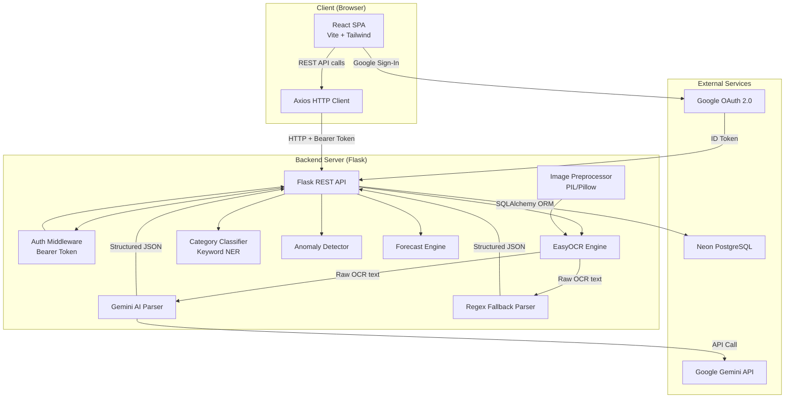
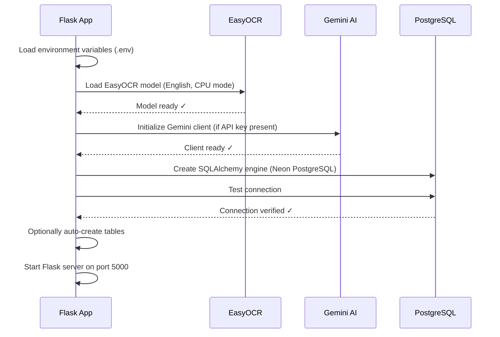
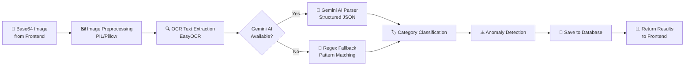
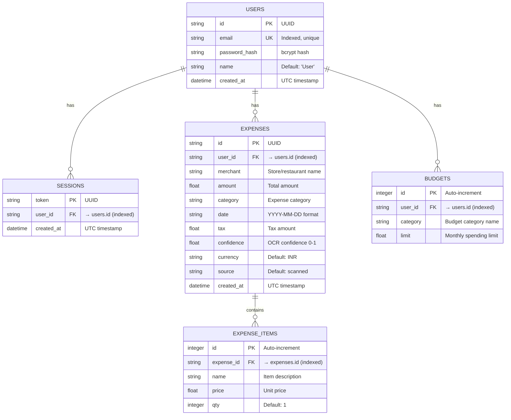
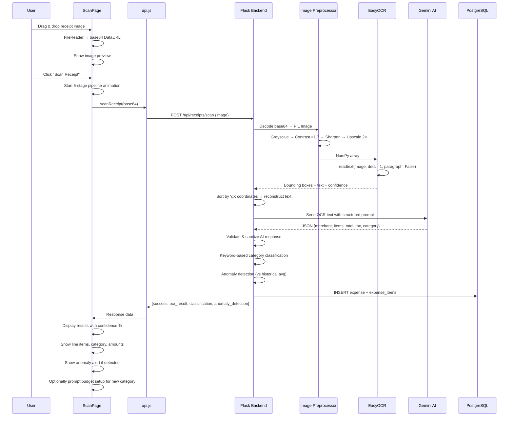
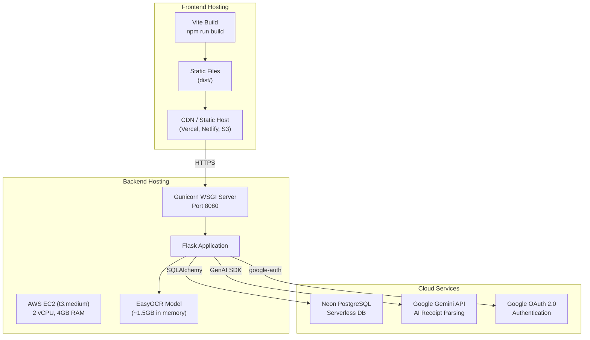

# ReceiptAI — Receipt Scanner & Budget Planner

## Complete Project Documentation

**Project Name:** ReceiptAI — ML-Powered Receipt Scanner & Budget Planner  
**Version:** 1.0.0  
**Date:** April 17, 2026  
**Author:** Pranav Khandelwal  

---

## Table of Contents

1. [Project Overview](#1-project-overview)
2. [Technology Stack](#2-technology-stack)
3. [System Architecture](#3-system-architecture)
4. [Project Structure](#4-project-structure)
5. [Frontend Deep Dive](#5-frontend-deep-dive)
6. [Backend Deep Dive](#6-backend-deep-dive)
7. [OCR & AI Pipeline](#7-ocr--ai-pipeline)
8. [Database Schema](#8-database-schema)
9. [REST API Endpoints](#9-rest-api-endpoints)
10. [Authentication Flow](#10-authentication-flow)
11. [Data Flow Walkthrough](#11-data-flow-walkthrough)
12. [Deployment Architecture](#12-deployment-architecture)
13. [Environment Configuration](#13-environment-configuration)
14. [Key Algorithms & Logic](#14-key-algorithms--logic)

---

## 1. Project Overview

ReceiptAI is a **full-stack, AI-powered receipt scanning and budget planning application**. Users upload photos of paper receipts, and the system automatically:

- **Extracts text** from the image using OCR (Optical Character Recognition)
- **Parses structured data** (merchant name, line items, totals, tax, date) using Google Gemini AI
- **Classifies expenses** into categories (Food, Groceries, Transport, etc.) via keyword-based NER
- **Detects anomalies** in spending by comparing against historical averages
- **Tracks budgets** per category with visual progress indicators
- **Forecasts spending** trends for the next 30 days
- **Visualizes analytics** with interactive charts (area charts, pie charts, progress bars)

The application supports **email/password authentication** and **Google OAuth 2.0 sign-in**.

---

## 2. Technology Stack

### 2.1 Frontend

| Technology | Version | Purpose |
|---|---|---|
| **React** | 19.2.4 | Core UI library — component-based SPA |
| **Vite** | 8.0.4 | Build tool & dev server — HMR, ESM-native bundling |
| **Tailwind CSS** | 3.4.19 | Utility-first CSS framework (preflight disabled, hybrid with vanilla CSS) |
| **Framer Motion** | 12.38.0 | Declarative animations — sidebar cursor, page transitions |
| **Recharts** | 3.8.1 | Chart library — Area charts, Pie charts for analytics |
| **Axios** | 1.14.0 | HTTP client — API communication with interceptors |
| **Lucide React** | 1.7.0 | Icon library — consistent SVG icons throughout UI |
| **React Dropzone** | 15.0.0 | Drag-and-drop file upload for receipt images |
| **date-fns** | 4.1.0 | Date formatting and manipulation |
| **@react-oauth/google** | 0.13.4 | Google OAuth 2.0 login integration |
| **styled-components** | 6.3.12 | CSS-in-JS (available, used minimally) |

### 2.2 Backend

| Technology | Version | Purpose |
|---|---|---|
| **Python** | 3.x | Backend runtime language |
| **Flask** | 3.0.3 | Lightweight WSGI web framework — REST API server |
| **Flask-CORS** | 4.0.1 | Cross-Origin Resource Sharing — allows frontend requests |
| **SQLAlchemy** | 2.0.36 | ORM (Object-Relational Mapping) — database models & queries |
| **Alembic** | 1.13.3 | Database migration tool — schema versioning |
| **psycopg2-binary** | 2.9.9 | PostgreSQL database adapter for Python |
| **EasyOCR** | latest | Deep-learning OCR engine — text extraction from images |
| **Pillow (PIL)** | latest | Image preprocessing — grayscale, contrast, sharpening, upscaling |
| **NumPy** | latest | Numerical arrays — image data conversion for OCR |
| **Google GenAI SDK** | ≥1.0.0 | Gemini AI integration — intelligent receipt parsing |
| **bcrypt** | 4.2.0 | Password hashing — secure credential storage |
| **google-auth** | 2.35.0 | Google OAuth token verification |
| **python-dotenv** | 1.0.1 | Environment variable loading from `.env` files |
| **Gunicorn** | latest | Production WSGI HTTP server |

### 2.3 Database & Cloud

| Service | Purpose |
|---|---|
| **Neon PostgreSQL** | Serverless Postgres — cloud-hosted primary database |
| **AWS EC2** (t3.medium) | Backend hosting — 2 vCPU, 4 GB memory for EasyOCR/PyTorch |
| **AWS App Runner** | Alternative deployment — container-based auto-scaling |
| **Google Cloud Console** | OAuth 2.0 client credentials & Gemini API keys |

### 2.4 Development Tools

| Tool | Purpose |
|---|---|
| **ESLint** | JavaScript linting — code quality enforcement |
| **PostCSS** | CSS processing pipeline — Tailwind integration |
| **Autoprefixer** | Vendor prefix automation for CSS |
| **Git** | Version control |

---

## 3. System Architecture



### Architecture Highlights

- **Monolithic Backend**: Single `app.py` file (~1191 lines) handles all routing, business logic, OCR, and AI integration
- **SPA Frontend**: React single-page application with client-side routing via a `PAGE_MAP` object (no React Router)
- **Stateless Auth**: Bearer token-based sessions stored in the `sessions` database table
- **Dual Parser**: Gemini AI primary parser with automatic regex-based fallback
- **EasyOCR Singleton**: OCR model loaded once at startup to avoid repeated model loading overhead

---

## 4. Project Structure

```
Receipt Scanner/
├── frontend/                          # React SPA
│   ├── index.html                     # HTML entry point with SEO meta tags
│   ├── package.json                   # Node.js dependencies
│   ├── vite.config.js                 # Vite build configuration
│   ├── tailwind.config.js             # Tailwind CSS config (preflight disabled)
│   ├── postcss.config.js              # PostCSS pipeline
│   ├── .env                           # Frontend environment variables
│   ├── dist/                          # Production build output
│   └── src/
│       ├── main.jsx                   # App entry — React root + GoogleOAuthProvider
│       ├── App.jsx                    # Root component — routing, layout, auth gate
│       ├── AuthContext.jsx            # Authentication context provider
│       ├── ToastContext.jsx           # Toast notification system
│       ├── api.js                     # Axios API service layer
│       ├── utils.js                   # Currency formatting helpers
│       ├── index.css                  # Global styles (23KB — comprehensive design system)
│       ├── components/
│       │   ├── Sidebar.jsx            # Floating top navigation bar with animated cursor
│       │   ├── ui/
│       │   │   ├── Loader.jsx         # Animated loading spinner
│       │   │   └── nav-header.tsx     # Navigation header component
│       │   └── blocks/
│       │       └── demo.tsx           # Demo block component
│       └── pages/
│           ├── LoginPage.jsx          # Landing/auth page (34KB — full design with animations)
│           ├── Dashboard.jsx          # Main dashboard — stats, charts, budget overview
│           ├── ScanPage.jsx           # Receipt upload & OCR pipeline visualization
│           ├── ExpensesPage.jsx       # Expense history list with filters
│           ├── BudgetPage.jsx         # Category budget management
│           ├── AnalyticsPage.jsx      # Spending analytics & visualizations
│           ├── ForecastPage.jsx       # 30-day AI spending forecast
│           ├── AnomaliesPage.jsx      # Anomaly detection alerts
│           └── SettingsPage.jsx       # Budget configuration & preferences
│
├── backend/                           # Flask API Server
│   ├── app.py                         # Main application (1191 lines — entire backend)
│   ├── requirements.txt               # Python dependencies
│   ├── .env                           # Backend environment variables
│   ├── .env.example                   # Environment template
│   ├── alembic.ini                    # Alembic migration configuration
│   ├── alembic/                       # Database migration scripts
│   ├── apprunner.yaml                 # AWS App Runner deployment config
│   ├── models.txt                     # Available Gemini model listing
│   └── test_gemini.py                 # Gemini API test script
```

---

## 5. Frontend Deep Dive

### 5.1 Application Entry (`main.jsx`)

The entry point wraps the entire app in:
1. **`<StrictMode>`** — React development warnings
2. **`<GoogleOAuthProvider>`** — Conditionally wraps if `VITE_GOOGLE_CLIENT_ID` is set
3. **`<App />`** — Root component

### 5.2 Root Component (`App.jsx`)

The `App` component sets up the provider hierarchy:

```
ToastProvider → AuthProvider → AppShell
```

**AppShell** handles:
- **Auth gating**: If no user is logged in → render `<LoginPage />`
- **Budget setup check**: On login, checks if budget configuration is required → forces `SettingsPage`
- **Page routing**: Uses a `PAGE_MAP` dictionary (not React Router) for client-side navigation
- **Layout**: Renders `<Sidebar />` + `<main>` with the active page component

### 5.3 Navigation (`Sidebar.jsx`)

A **floating top navigation bar** using Framer Motion:
- Pill-shaped navigation with animated cursor that follows active/hovered tab
- Spring-physics animation (`stiffness: 400, damping: 30`)
- Responsive: Icons only on mobile, icons + labels on desktop
- Includes logout button with red icon
- When budget setup is required, only the Settings tab is shown

### 5.4 Pages Overview

| Page | File Size | Key Features |
|---|---|---|
| **LoginPage** | 34.6 KB | Split-panel design, animated particles/orbs, Google OAuth, tabbed login/register |
| **Dashboard** | 9.9 KB | 4 stat cards, area chart (monthly trend), pie chart (categories), budget overview |
| **ScanPage** | 15.5 KB | Drag-and-drop upload, 5-stage pipeline indicator, result display, budget prompt modal |
| **ExpensesPage** | 10.7 KB | Expense list with category filters, delete functionality |
| **BudgetPage** | 9.9 KB | Category budget limits, progress bars with status (good/warning/over) |
| **AnalyticsPage** | 6.9 KB | Spending analytics summary, charts |
| **ForecastPage** | 5.3 KB | 30-day spending forecast per category |
| **AnomaliesPage** | 5.7 KB | Anomalous transaction alerts |
| **SettingsPage** | 7.9 KB | Budget category toggle & limit configuration |

### 5.5 API Service Layer (`api.js`)

Centralized Axios instance with:
- **Base URL**: `VITE_API_BASE_URL` or defaults to `http://localhost:5000/api`
- **Request interceptor**: Automatically attaches `Authorization: Bearer <token>` header
- **Token management**: `localStorage` with key `receiptai_token`
- **Timeout**: 30s default, 120s for receipt scanning

### 5.6 Authentication Context (`AuthContext.jsx`)

React Context providing:
- `user` — current user object `{id, email, name}`
- `loading` — initial session validation state
- `login(email, password)` — email/password authentication
- `register(name, email, password)` — account creation
- `loginWithGoogle(idToken)` — Google OAuth flow
- `logout()` — session destruction

### 5.7 Design System

The application uses a **premium dark-mode design** with:
- Custom CSS variables for colors, gradients, and spacing
- Glassmorphism effects (`backdrop-filter: blur`)
- Animated background orbs and floating particles on the login page
- Gradient text effects
- Spring-physics animated navigation cursor
- Progress bars with status-based colors (green/amber/red)
- Toast notifications with emoji icons

---

## 6. Backend Deep Dive

### 6.1 Application Initialization Sequence



### 6.2 Key Design Decisions

1. **Single-file backend**: All routes, models, and logic in `app.py` for simplicity
2. **EasyOCR lazy load**: Model loaded once at startup, reused for all requests
3. **Dual parser strategy**: Gemini AI primary → regex fallback ensures reliability
4. **Database sessions per request**: `get_db()` creates a new session, manually closed after use
5. **UUID-based IDs**: All primary keys use UUIDs for non-sequential, distributed-safe IDs
6. **bcrypt password hashing**: Industry-standard hashing with automatic salt generation

---

## 7. OCR & AI Pipeline

This is the core feature of the application. When a user uploads a receipt image, the following pipeline executes:

### 7.1 Pipeline Stages



### 7.2 Stage 1: Image Preprocessing

```python
# Pipeline steps:
1. Decode base64 → PIL Image
2. Convert to RGB
3. Convert to Grayscale (L mode)
4. Enhance Contrast (factor: 1.7×)
5. Apply SHARPEN filter
6. Upscale 2× using LANCZOS resampling
7. Convert to NumPy array for EasyOCR
```

**Why these steps?**
- Grayscale reduces noise from colorful receipt backgrounds
- High contrast makes faded thermal paper text more readable
- Sharpening defines text edges for better OCR accuracy
- 2× upscaling improves recognition of small print

### 7.3 Stage 2: EasyOCR Text Extraction

- Engine: **EasyOCR** with English language model
- GPU: Disabled (`gpu=False`) — runs on CPU for compatibility
- Confidence threshold: Lines below 25% confidence are discarded
- Output: Text sorted by Y-coordinate (top-to-bottom) then X-coordinate (left-to-right) to reconstruct receipt layout

### 7.4 Stage 3A: Gemini AI Parser (Primary)

The raw OCR text is sent to Google Gemini with a structured prompt requesting:
- Merchant name, date, currency
- Individual line items with name, unit price, quantity
- Subtotal, tax, total
- Expense category

**Model fallback chain**: `gemini-3-flash-preview` → `gemini-2.0-flash` → `gemini-2.5-flash`

The AI response is validated and sanitized:
- Prices converted to floats
- Quantities ensured ≥ 1
- Missing totals calculated from items
- Category cross-checked against allowed categories

### 7.5 Stage 3B: Regex Fallback Parser

If Gemini is unavailable or fails, the system uses regex-based parsing:

| Extraction | Method |
|---|---|
| **Merchant** | Longest meaningful text in first 8 lines (≥3 alpha chars, not pure numbers) |
| **Total** | Lines matching `total`, `grand total`, `amount due` keywords + price regex |
| **Tax** | Lines matching `tax`, `gst`, `vat`, `cgst`, `sgst` keywords |
| **Date** | Regex for DD/MM/YYYY, MM/DD/YYYY, YYYY-MM-DD, "Month DD, YYYY" formats |
| **Line Items** | Lines with prices that aren't total/tax, with quantity detection (e.g., "2 x 2.97") |

### 7.6 Stage 4: Category Classification

Keyword-based classification against **11 categories**:

| Category | Example Keywords |
|---|---|
| Food & Dining | restaurant, cafe, pizza, mcdonald, swiggy, zomato |
| Groceries | grocery, supermarket, walmart, dmart, costco |
| Transportation | uber, ola, petrol, metro, flight, irctc |
| Healthcare | pharmacy, hospital, apollo, medplus, medicine |
| Entertainment | pvr, cinema, netflix, bookmyshow, gaming |
| Utilities | electricity, jio, airtel, broadband, recharge |
| Shopping | myntra, amazon, flipkart, nike, electronics |
| Education | udemy, coursera, books, school, training |
| Travel | hotel, oyo, airbnb, makemytrip, resort |
| Personal Care | salon, spa, barber, haircut, grooming |
| Miscellaneous | (default fallback) |

The classifier counts keyword matches per category and selects the highest-scoring one.

### 7.7 Stage 5: Anomaly Detection

Compares the new transaction amount against the **average** of all previous transactions in the same category:
- **Anomaly threshold**: Amount > 2.5× category average
- **Anomaly score**: `min(amount / (avg × 3), 1.0)` — normalized 0 to 1

---

## 8. Database Schema



### Schema Notes

- **Cascade deletes**: Deleting an expense automatically deletes its items (`cascade="all, delete-orphan"`)
- **Joined loading**: Expense items are eagerly loaded with expenses (`lazy="joined"`)
- **No expiry on sessions**: Tokens are valid until explicitly logged out
- **Migration tool**: Alembic for schema versioning (preferred over `AUTO_CREATE_TABLES`)

---

## 9. REST API Endpoints

### 9.1 Health Check

| Method | Endpoint | Auth | Description |
|---|---|---|---|
| `GET` | `/api/health` | No | Returns server status, OCR engine info, user count |

### 9.2 Authentication

| Method | Endpoint | Auth | Request Body | Response |
|---|---|---|---|---|
| `POST` | `/api/auth/register` | No | `{email, password, name}` | `{token, user}` |
| `POST` | `/api/auth/login` | No | `{email, password}` | `{token, user}` |
| `POST` | `/api/auth/google` | No | `{id_token}` | `{token, user}` |
| `GET` | `/api/auth/me` | Yes | — | `{user}` |
| `POST` | `/api/auth/logout` | Yes | — | `{success: true}` |

### 9.3 Receipt Scanning

| Method | Endpoint | Auth | Request Body | Response |
|---|---|---|---|---|
| `POST` | `/api/receipts/scan` | Yes | `{image: "<base64>"}` | `{success, expense_id, ocr_result, classification, anomaly_detection, processing_time_ms}` |

**OCR Result Object:**
```json
{
  "merchant": "McDonald's India",
  "date": "2026-04-17",
  "items": [{"name": "McChicken Burger", "price": 149.0, "qty": 2}],
  "subtotal": 654.55,
  "tax": 32.73,
  "total": 687.28,
  "currency": "INR",
  "category": "Food & Dining",
  "raw_lines": 24,
  "confidence": 0.87,
  "ocr_engine": "easyocr+gemini"
}
```

### 9.4 Expenses

| Method | Endpoint | Auth | Params/Body | Response |
|---|---|---|---|---|
| `GET` | `/api/expenses` | Yes | `?category=X&limit=100` | `{expenses: [...], total}` |
| `DELETE` | `/api/expenses/:id` | Yes | — | `{success: true}` |

### 9.5 Budget Management

| Method | Endpoint | Auth | Body | Response |
|---|---|---|---|---|
| `GET` | `/api/budget` | Yes | — | `{requires_setup, total_budget, total_spent, categories: [...]}` |
| `PUT` | `/api/budget/:category` | Yes | `{limit}` | `{success: true}` |
| `GET` | `/api/settings/budget-config` | Yes | — | `{requires_setup, categories: [...]}` |
| `PUT` | `/api/settings/budget-config` | Yes | `{categories: [...]}` | `{success, requires_setup}` |

### 9.6 Analytics & Intelligence

| Method | Endpoint | Auth | Response |
|---|---|---|---|
| `GET` | `/api/analytics/summary` | Yes | `{by_category, monthly_trend, top_merchant, avg_transaction, total_transactions, total_spent}` |
| `GET` | `/api/forecast` | Yes | `{forecasts: [...], horizon_days: 30}` |
| `GET` | `/api/anomalies` | Yes | `{anomalies: [...], total}` |

---

## 10. Authentication Flow

```mermaid
sequenceDiagram
    participant U as User
    participant F as Frontend
    participant B as Backend
    participant G as Google OAuth
    participant DB as PostgreSQL

    alt Email/Password Login
        U->>F: Enter email & password
        F->>B: POST /api/auth/login
        B->>DB: Query user by email
        B->>B: bcrypt.checkpw(password, hash)
        B->>DB: Create session (UUID token)
        B-->>F: {token, user}
        F->>F: Store token in localStorage
    end

    alt Google OAuth
        U->>F: Click "Continue with Google"
        F->>G: Google Sign-In popup
        G-->>F: ID Token (JWT)
        F->>B: POST /api/auth/google {id_token}
        B->>G: Verify token with Google
        B->>DB: Find or create user by email
        B->>DB: Create session
        B-->>F: {token, user}
        F->>F: Store token in localStorage
    end

    Note over F,B: All subsequent API calls include<br/>Authorization: Bearer <token>
```



### Token Lifecycle
1. **Creation**: UUID token generated on login/register
2. **Storage**: Frontend stores in `localStorage` (`receiptai_token`)
3. **Transmission**: Axios interceptor adds `Authorization: Bearer <token>` to every request
4. **Validation**: `auth_required` decorator checks token against `sessions` table
5. **Destruction**: `POST /api/auth/logout` deletes the session row

---

## 11. Data Flow Walkthrough

### 11.1 Receipt Scanning — End-to-End



### 11.2 Budget Tracking Flow

1. User sets budget limits per category in **Settings**
2. Each scanned receipt is auto-categorized and saved
3. **Budget page** aggregates spending per category vs limits
4. Progress bars show: 🟢 Good (< 75%), 🟡 Warning (75–99%), 🔴 Over (≥ 100%)
5. Dashboard shows top 6 categories with spending progress

---

## 12. Deployment Architecture



### Deployment Configuration (`apprunner.yaml`)

```yaml
version: 1.0
runtime: python3
build:
  commands:
    build:
      - pip install -r requirements.txt
run:
  command: gunicorn app:app --bind=0.0.0.0:8080
  network:
    port: 8080
  compute:
    cpu: "2 vcpu"
    memory: "4 gb"
```

> [!IMPORTANT]
> EasyOCR with PyTorch requires a minimum of **4 GB RAM** and benefits from 2+ vCPUs. A `t3.medium` EC2 instance is the minimum viable production instance.

---

## 13. Environment Configuration

### 13.1 Backend (`.env`)

| Variable | Required | Description |
|---|---|---|
| `DATABASE_URL` | ✅ Yes | Neon PostgreSQL connection string (`postgresql://...?sslmode=require`) |
| `GOOGLE_CLIENT_ID` | Optional | Google OAuth client ID for social login |
| `GEMINI_API_KEY` | Optional | Google Gemini API key for AI receipt parsing |
| `AUTO_CREATE_TABLES` | Optional | Set to `true` to auto-create tables without Alembic |

### 13.2 Frontend (`.env`)

| Variable | Required | Description |
|---|---|---|
| `VITE_API_BASE_URL` | Optional | Backend API URL (default: `http://localhost:5000/api`) |
| `VITE_GOOGLE_CLIENT_ID` | Optional | Google OAuth client ID (same as backend) |

---

## 14. Key Algorithms & Logic

### 14.1 Price Extraction Regex

```
Pattern: [\$₹£€]?\s*(\d{1,3}(?:[,\s]\d{3})*(?:\.\d{1,2})?)
Matches: $12.99, ₹1,299.00, 1299, £45.50, €1 299.50
```

### 14.2 Total Detection

1. Scan all lines for "total", "grand total", "amount due" keywords
2. Extract the **largest** price from the total line
3. If no total keyword found → use the **largest price** across all lines
4. Tax lines detected separately via "tax", "gst", "vat" keywords
5. Sanity check: Tax capped at 30% of total

### 14.3 Line Item Extraction

1. Filter out total/tax lines
2. Extract name (text before price) and price per line
3. Detect quantities via patterns like `2 x 2.97` or `qty: 3`
4. Deduplicate items by name (merge quantities)
5. Cap at 12 items maximum
6. Reconcile item total with detected subtotal (adjust if gap < 6%)

### 14.4 Anomaly Score Calculation

```python
category_average = mean(all_expenses_in_same_category)
is_anomaly = (amount > category_average * 2.5)
anomaly_score = min(amount / (category_average * 3), 1.0)
```

### 14.5 Spending Forecast

For each category:
1. Sum all historical expenses in that category
2. Apply random trend factor (±4% to ±18%)
3. Return projected 30-day spending amount with trend direction

### 14.6 Budget Status Calculation

```
percentage = (spent / limit) × 100
status:
  "over"    → percentage ≥ 100%
  "warning" → percentage ≥ 75%
  "good"    → percentage < 75%
```

---

> [!NOTE]
> **Document generated from source code analysis of the ReceiptAI project repository.**  
> Backend: `app.py` (1,191 lines) | Frontend: 9 pages, 3 contexts, centralized API service  
> Total estimated codebase size: ~200KB of application code
